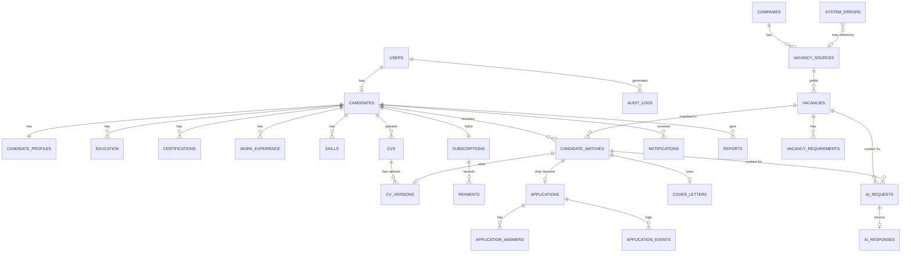

# SOSPANA SONKE — Product & Technical Blueprint

**AI-powered job discovery, CV tailoring and application platform for South Africa**

*"We find the opportunities. We tailor your application. We help you apply smarter."*

| | |
|---|---|
| **Version** | 1.0 (Blueprint / pre-build) |
| **Date** | 11 August 2026 |
| **Prepared for** | Lungani (Founder) |
| **Price point** | R100 / month per candidate |
| **Status** | Architecture & planning — no code yet. Awaiting "BUILD PHASE 1". |

> **How to read this document.** It is written so that you — as the founder — can understand and evaluate every decision, and so that a developer (or development team) you hire can execute it without further design work. Where something is a genuine judgement call or a place to get professional advice, it is flagged clearly. Technical detail is deliberately explained in plain language first, with the precise terms afterwards.

---

## Table of contents

1. Executive summary
2. Product vision
3. User personas
4. Complete user journey
5. Functional requirements
6. Non-functional requirements
7. System architecture
8. Technology stack recommendation
9. Database architecture
10. Database ERD
11. API architecture
12. AI architecture
13. Vacancy scraping architecture
14. ATS / application automation architecture
15. Security architecture
16. POPIA / privacy considerations
17. Subscription / payment architecture
18. Cost model at R100/month
19. MVP scope
20. Phase 2
21. Phase 3
22. Development roadmap
23. Repository structure
24. Testing strategy
25. Monitoring strategy
26. Disaster recovery
27. Business risks
28. Technical risks
29. Legal / compliance risks
30. Recommended mitigations
31. Step-by-step implementation plan

---

## 1. Executive summary

Sospana Sonke is a subscription web platform that helps South African job seekers find, match to, and apply for jobs advertised directly on employers' own careers pages — starting with JSE-listed companies. Instead of paying expensive job-board APIs, the platform maintains its own database of official careers URLs, periodically checks them for new vacancies, and uses AI to (a) understand each vacancy, (b) honestly assess whether a candidate qualifies, (c) generate a tailored CV and cover letter, and (d) help the candidate apply — automatically where that is technically and legally possible, and with clear guidance where it is not.

The commercial model is a single flat fee of **R100 per month**. Everything the candidate needs — matching, tailored CVs, cover letters, application preparation, tracking, and reports — is included. There are no per-document charges.

Three principles sit at the centre of the design:

**Truthfulness.** The AI never invents qualifications, experience, certifications, or answers. Missing information is marked as missing and handed back to the candidate.

**Candidate control.** Nothing is submitted to an employer without the candidate's authorisation. The candidate chooses how much autonomy to grant, from fully manual to supervised-automatic.

**Cost discipline.** Because revenue per user is small, the architecture is engineered to keep the cost of serving each candidate low — cheap deterministic filtering before any expensive AI call, heavy caching, deduplication, and shared vacancy processing across all candidates.

The recommended build is a modern, mostly-managed stack (Next.js frontend, FastAPI Python backend, PostgreSQL, Redis, background workers, S3-compatible storage) that a small team or a single contracted developer can operate cheaply. The document defines an MVP that delivers a genuinely working product, then two later phases that add automated submission, notifications, and advanced features.

The economics are workable at R100/month **provided** the expensive parts — AI usage and browser automation — are shared and rationed aggressively, which this architecture is specifically designed to do. Section 18 models the margins.

---

## 2. Product vision

South Africa has very high unemployment and a job-search process that is slow, repetitive, and demoralising. Good candidates miss opportunities because vacancies are scattered across dozens of different employer websites and applicant-tracking systems, each with its own format and forms. Writing a fresh, well-targeted CV for every role is exhausting, so most people send one generic CV everywhere — which performs poorly against automated screening.

Sospana Sonke's vision is to give every South African job seeker a tireless, honest, affordable assistant that does the tedious 90% of a good job search: watching the right employers, spotting new roles the moment they appear, judging fit realistically, and producing a genuinely tailored application — while leaving the candidate fully in control and never misrepresenting who they are.

The brand promise is deliberately modest and trustworthy. It does **not** promise jobs. It promises better-targeted effort: *the opportunities found, the application tailored, applying done smarter.* That honesty is a feature — it protects candidates and it protects the business legally and reputationally.

Success looks like: a candidate pays R100, uploads a CV once, and within a day receives a shortlist of well-matched real vacancies at real employers, each with a ready tailored CV and a clear "apply" path — and can see, at any time, exactly what the system did on their behalf and why.

---

## 3. User personas

**Persona 1 — Thandi, the recent graduate (primary).** 23, has a BCom, limited work experience, applying to graduate programmes and entry roles at large listed companies. Tech-comfortable on a phone, price-sensitive, overwhelmed by the number of corporate careers portals. Needs: help finding graduate intakes, an honest read on which she qualifies for, and CVs that get past automated screening. Fears wasting the R100 and being rejected everywhere.

**Persona 2 — Sipho, the mid-career professional (primary).** 34, six years in operations/logistics, employed but looking to move up. Time-poor, applies to a handful of specific senior roles. Values quality and discretion over volume. Needs: strong matching that respects hard requirements, tailored senior-level CVs, and control over what gets submitted (he does not want automatic applications firing off in his name).

**Persona 3 — Nomsa, the returning worker (secondary).** 41, out of formal work for two years, re-entering the market. Less digitally confident. Needs: a very simple, guided experience, plenty of explanation, and reassurance that nothing embarrassing or untrue is sent on her behalf.

**Persona 4 — Lungani, the platform administrator / founder (internal).** Manages the company database, imports careers URLs, watches scraper health, tunes matching thresholds, monitors costs, and handles support. Needs: a solid admin dashboard, cost visibility, and alerts when a careers site breaks.

**Persona 5 — The employer (indirect, not a user).** Never logs in, but their careers site and application forms are the environment the platform operates in. Their terms of use, robots rules, and anti-bot controls constrain what the platform may do. Designing to respect them is non-negotiable.

---

## 4. Complete user journey

**Discovery & sign-up.** The candidate lands on a marketing page that clearly states the R100/month, all-inclusive promise and the honest disclaimer (no guaranteed jobs). They register with name, surname, email, mobile number, and password. Email is verified by a link; the mobile number is stored for later optional SMS. MFA and Google/Microsoft sign-in are optional and can be added in Phase 2 without redesign.

**Free account & profile.** Before paying, the candidate can create their account and build a profile — this reduces the barrier to entry and lets them see value before the paywall. They complete the profile (personal, career preferences, education, certifications, work experience, skills, and "other" details such as languages, driver's licence, memberships, and links).

**CV upload & intelligence.** The candidate uploads an existing CV (PDF, DOCX, or TXT). The system stores the **original untouched**, extracts the text, and uses AI to build a structured profile — employment history, education, skills, seniority, industries, and keywords — which is pre-filled into the profile for the candidate to confirm and correct. The candidate always has the final say; nothing is treated as fact until they confirm it.

**Subscription.** To unlock matching and applications, the candidate subscribes for R100/month via a South-African payment provider. Subscription state gates all paid functionality. A short free trial is optional (Section 17).

**Preferences & autonomy.** The candidate sets their approval mode (automatic / approval-required / assisted), minimum match score, daily and weekly application caps, salary floor, preferred and excluded industries and companies, location and remote preferences, and relocation willingness.

**Matching (runs in the background).** The platform continuously discovers vacancies from the company database (shared across all users). On a schedule, each candidate's confirmed profile is matched against new, relevant vacancies. Cheap deterministic filters run first (location, hard-requirement keywords, excluded companies); only survivors go to the AI matcher, which produces an explainable score and an APPLY / DO NOT APPLY decision with reasons, gaps, and a confidence level.

**Review & tailor.** For strong matches, the system generates a tailored, truthful CV and (where useful) a cover letter. The candidate reviews the match explanation, the tailored CV, and the cover letter in the dashboard.

**Apply.** Depending on the candidate's chosen mode and what the employer's site allows: the system submits automatically (only where permitted and no human step like CAPTCHA/MFA is required), or prepares everything and asks the candidate to approve, or hands the candidate a ready-to-submit package with exact instructions. CAPTCHA, MFA, or login walls always stop automation and request candidate action — they are never bypassed.

**Track & report.** Every vacancy considered, matched, or rejected, and every application and its status, is tracked with a full audit trail. After each cycle the candidate gets a clear report (viewable and downloadable as PDF) of what was analysed, matched, rejected (and why), generated, and submitted.

**Ongoing.** Notifications (dashboard, email, later SMS/push) alert the candidate to strong new matches and to any action required. The candidate can pause, adjust preferences, export their data, or delete their account at any time.

---

## 5. Functional requirements

The platform must let a candidate register, verify email, log in securely, reset a password, and optionally enable MFA. It must let them build and maintain a full candidate profile across personal, career, education, certification, work-experience, skills, and "other" categories. It must accept CV uploads in PDF, DOCX, and TXT; store the original immutably; extract and structure the content; and pre-fill the profile for confirmation.

An administrator must be able to maintain a database of companies and their official careers URLs, including bulk CSV import, editing, deactivation, per-company automation policy, and URL testing. The platform must periodically visit those URLs, adapt to different page and ATS structures, detect new vacancies, extract structured vacancy data, store the original advertisement content, and deduplicate repeated postings.

For each candidate the platform must match their confirmed profile against relevant vacancies using a configurable weighted score, separate hard from soft requirements, produce an explainable APPLY / DO NOT APPLY decision, and record it. For qualifying vacancies it must generate a truthful tailored CV (with version history, original never overwritten) and, where useful, a cover letter, in both PDF and DOCX.

The platform must support three application modes (automatic, approval-required, assisted); prepare application packages; assist with or complete forms where permitted; never fabricate application answers (marking unknowns for candidate input); and submit only with candidate authorisation. It must track every vacancy and application through a defined status lifecycle with a full audit trail, and generate per-cycle candidate reports downloadable as PDF.

It must enforce anti-spam controls (per-day, per-week, and per-company caps, minimum score, cooldowns, duplicate prevention). It must send notifications via dashboard and email (SMS/push later). It must manage subscriptions and payments (R100/month, state machine, gating). It must give the administrator a dashboard for companies, scans, extracted vacancies, parsing errors, users, subscriptions, system health, AI prompts, thresholds, scan frequency, and logs. It must let candidates export their data and delete their account.

---

## 6. Non-functional requirements

The system should feel responsive for interactive actions (profile edits, dashboard views, CV preview) — target under ~1.5 seconds for typical pages — while accepting that scraping, matching, and document generation are background jobs that complete in minutes, not synchronously. It must be reliable enough that a missed scan or a failed employer site never loses candidate data or corrupts tracking; failures are logged, retried with backoff, and surfaced to the admin.

It must be secure and POPIA-aligned by design (Sections 15–16): encryption in transit, sensitive data encrypted at rest, hashed passwords, least-privilege access, audit logging, and a defined data-retention policy. It must be cost-efficient above almost all else (Section 18), because unit revenue is small: deterministic filtering before AI, caching, dedup, batching, and cheap models for cheap tasks.

It must be maintainable by a small team: conventional, well-documented technologies; clear module boundaries; automated tests; and infrastructure that is mostly managed rather than hand-operated. It must scale horizontally from ~100 to tens of thousands of candidates without re-architecture — achieved by separating the web layer, the shared vacancy pipeline, and per-candidate background work into independently scalable pieces. It must be observable: structured logs, metrics, error tracking, and health dashboards. It should be accessible and mobile-friendly, since many South African users are primarily on phones.

---

## 7. System architecture

The platform is built as a small number of cooperating services rather than one monolith, so that the cheap interactive parts and the expensive background parts scale independently.

At the front is the **web application** (Next.js) that candidates and the administrator use in their browsers. It talks only to the **API backend** (FastAPI), which owns all business logic, authentication, subscription gating, and the database. The API never lets the browser touch the database directly.

Behind the API sits **PostgreSQL** (the single source of truth for all structured data) and **Redis** (used both as a fast cache and as the job queue). Uploaded and generated files (original CVs, tailored CVs, cover letters, reports) live in **S3-compatible object storage**, not in the database — the database only stores references and metadata.

The heavy work happens in **background workers** that pull jobs from the queue, so the website stays fast. There are three logical worker roles, which can run as one process early on and be split later:

- The **scraper/discovery workers** visit careers URLs on a schedule, extract vacancies, and write them to the shared vacancy database. This work is done **once per vacancy for the whole platform**, not per candidate — this is the single most important cost decision.
- The **matching workers** compare candidate profiles to new vacancies using cheap filters first, then AI.
- The **document workers** generate tailored CVs, cover letters, and report PDFs.

A **scheduler** (see Section 22) enqueues recurring jobs (scan high-priority companies every N hours, scan all companies daily, run matching nightly, send morning notifications).

All AI calls go through a single **AI provider abstraction** (Section 12) so the model or vendor can be swapped centrally. All application-submission automation goes through an **application engine** (Section 14) that is strictly bounded by per-source policy.

```
        ┌────────────┐
        │  Browser   │  candidate + admin
        └─────┬──────┘
              │ HTTPS
        ┌─────▼───────────┐
        │  Next.js web    │
        └─────┬───────────┘
              │ REST API (auth + subscription gate)
        ┌─────▼───────────┐        ┌───────────────┐
        │  FastAPI API    │◄──────►│  PostgreSQL   │
        │  (business logic)│        └───────────────┘
        └───┬────────┬─────┘        ┌───────────────┐
            │        │        ┌────►│  Redis        │ cache + queue
            │        │        │     └───────────────┘
            │        ▼        │     ┌───────────────┐
            │   enqueue jobs ─┘     │ S3 storage    │ files
            │                       └───────────────┘
   ┌────────▼─────────────────────────────┐
   │  Background workers (from the queue)  │
   │  • scraper/discovery (shared)         │──► AI provider abstraction ─► Claude / OpenAI / local
   │  • matching (per candidate)           │
   │  • document generation                │──► application engine ─► employer sites (policy-bound)
   └────────────────────┬──────────────────┘
                        │
                 ┌──────▼──────┐
                 │  Scheduler  │ recurring jobs
                 └─────────────┘
```

---

## 8. Technology stack recommendation

The recommendation optimises for low cost, a small team, security, and hiring ease in South Africa. Where the master brief suggested options, the choice and reasoning are given.

**Frontend: Next.js (React) with TypeScript and Tailwind CSS.** Next.js is the mainstream React framework, easy to hire for, renders fast on mobile, and deploys cheaply. Tailwind keeps styling consistent and quick.

**Backend: Python with FastAPI.** Chosen over Node for the backend because the heavy lifting — CV parsing, document processing, scraping, AI orchestration — has far better libraries in Python, and keeping one backend language reduces complexity for a small team. FastAPI is fast, modern, and self-documenting (it generates the API spec automatically).

**Database: PostgreSQL.** The obvious choice: relational, reliable, supports JSON columns for semi-structured vacancy data, and has a vector extension (`pgvector`) so we can add embeddings-based matching later without a second database.

**Cache & queue: Redis + a Python task queue (Celery or RQ; RQ recommended for simplicity).** Redis doubles as cache and job broker, keeping the moving parts few.

**Background workers: the same Python codebase run as worker processes.** One deployable, multiple roles.

**Browser automation (Phase 2, where legitimately permitted): Playwright (Python).** Only invoked for JavaScript-heavy pages and permitted automated submissions; expensive, so rationed hard.

**Document processing:** `pdfplumber` / `PyMuPDF` for reading PDFs, `python-docx` for DOCX, plus AI for structuring. **Document generation:** HTML templates rendered to PDF with **WeasyPrint** (clean, ATS-friendly, easy templating) and `python-docx` for DOCX output.

**File storage: S3-compatible object storage** (AWS S3, or a cheaper compatible provider). **Malware scanning:** ClamAV on upload.

**AI:** Provider-abstracted (Section 12). Default to a cheap, capable model for routine work and a stronger model only for complex tailoring.

**Payments: Paystack (South Africa)** as the first provider (Section 17), behind a swappable payment abstraction.

**Email:** a transactional email provider (e.g., Amazon SES for low cost, or Resend/Postmark for simplicity).

**Containers & deployment: Docker**, deployed to an affordable managed platform. For a non-technical founder the lowest-ops path is a managed platform such as Railway, Render, or Fly.io early on (managed Postgres and Redis included), moving to a cloud VM or managed Kubernetes only if scale demands it. **Error tracking:** Sentry. **Logs/metrics:** the platform's built-in logging plus a lightweight metrics/uptime tool.

> **Note for the founder:** none of these choices lock you in. The database, payment provider, AI provider, and hosting can each be changed later because they sit behind clear boundaries in the design.

---

## 9. Database architecture

PostgreSQL is the single source of truth. The schema is normalised (data is not duplicated; related records link by IDs) with these principles applied throughout:

Every table has a primary key (`id`), created/updated timestamps, and — where records represent things a user might "delete" but which we must retain for audit or legal reasons — a `deleted_at` soft-delete column rather than a hard delete. Foreign keys enforce relationships (e.g., a work-experience row must belong to a real candidate). Indexes are placed on every foreign key and on columns used for lookups and dedup (email, JSE code, vacancy content hash, application status). Sensitive columns (ID numbers, contact details, uploaded-document references) are encrypted at rest at the application or column level, and access is logged.

The data separates three concerns cleanly:

**Per-candidate data** (profile, education, experience, skills, CVs, matches, applications, reports) — private to that candidate, protected by row-level access rules in the API.

**Shared platform data** (companies, vacancy sources, vacancies, vacancy requirements) — discovered once and reused across all candidates, so processing cost is amortised.

**Operational data** (subscriptions, payments, notifications, audit logs, system errors, AI request/response logs) — for billing, support, compliance, and cost control.

The vacancy tables store both the **structured** extracted fields and the **original raw content** (as stored text or a stored file reference), so that if extraction logic improves or a dispute arises, the original advertisement can be re-examined. A `content_hash` on vacancies powers deduplication.

---

## 10. Database ERD

The following entity-relationship diagram shows the core tables and their relationships. (One user has one candidate; a candidate has many of most things; vacancies belong to companies and are shared across candidates via matches.)



**Key tables and notable fields:**

- **users**: id, email (unique), password_hash, email_verified, mfa_enabled, role (candidate/admin), timestamps.
- **candidates / candidate_profiles**: personal, career, location, salary, autonomy-mode and preference fields (approval mode, min score, caps, excluded companies/roles, remote pref, relocation).
- **education / certifications / work_experience / skills**: normalised child tables, each linked to a candidate, each field `confirmed_by_candidate` flag so AI-extracted data is distinguishable from candidate-verified data.
- **cvs**: original uploaded CV (immutable, storage reference, file hash). **cv_versions**: each AI-tailored CV, linked to the match it was made for, with template used and generated file references (PDF + DOCX).
- **companies**: id, company_name, jse_code, sector, careers_url, official_website, country, active, last_checked, next_check, scraping_status, automation_policy, robots_status, requires_login, captcha, ats_type, notes.
- **vacancy_sources**: a company can have more than one careers page/ATS; stores the detected ATS type and fetch strategy.
- **vacancies**: structured fields (title, department, location, type, salary, closing/posting date, description, application URL, source URL, employer vacancy ID) plus raw original content and content_hash for dedup.
- **vacancy_requirements**: each requirement classified hard vs soft, with type (qualification, experience-years, certification, registration, licence, skill, other).
- **candidate_matches**: candidate_id, vacancy_id, score, sub-scores, decision, reasons, gaps, confidence, status (the tracking lifecycle), prompt_version, model used.
- **applications / application_answers / application_events**: submission mode, status, submitted answers (with a source flag: from-profile vs candidate-entered vs AI-generated-and-approved), and a time-stamped event log = the audit trail.
- **cover_letters, reports, notifications, subscriptions, payments, audit_logs, system_errors, ai_requests, ai_responses**: as named, each timestamped.

---

## 11. API architecture

The backend exposes a versioned REST API (`/api/v1/...`) documented automatically by FastAPI (OpenAPI/Swagger), so the frontend developer and any future integrations have a precise contract. Every request is authenticated with a short-lived access token plus refresh token; every paid endpoint additionally checks subscription state; every candidate endpoint enforces that the caller can only touch their own records.

The API is organised by resource area: **auth** (register, verify email, login, refresh, password reset, MFA), **profile** (profile + education/certifications/experience/skills sub-resources), **cv** (upload, list, get, tailored versions), **matches** (list, get with explanation, trigger re-match), **applications** (list, get, prepare, approve, submit, mark-action-taken), **cover-letters**, **reports** (list, get, download PDF), **preferences**, **subscription** (status, checkout, cancel, payment webhook), **notifications**, and **account** (data export, deletion request). A separate **admin** area (role-gated) covers company CRUD + CSV import, source policy, manual scan triggers, scan results, extracted vacancies, parsing errors, user/subscription management, AI prompt management, threshold/schedule configuration, system health, and logs.

Design rules: input is validated strictly (using typed schemas) before touching the database; long-running actions (scan, match, generate, submit) return immediately with a job reference and are processed by workers, with status polled or pushed; all money, permissions, scoring arithmetic, and status transitions are handled by deterministic backend code, never by the AI; and every state-changing admin or application action writes an audit-log entry. Payment provider callbacks arrive at a dedicated, signature-verified webhook endpoint.

---

## 12. AI architecture

AI is used only where judgement or language generation is genuinely needed, and always behind a single **provider abstraction** — one internal interface (`AIProvider`) with interchangeable implementations for Claude, OpenAI, a local/open model, or future vendors. The administrator selects the active provider and model per task type; switching vendors is a configuration change, not a code rewrite.

**AI is used for:** interpreting a raw vacancy into structured fields and hard/soft requirements; producing the explainable match decision; tailoring CVs; drafting cover letters; interpreting application-form questions; and generating candidate-facing explanations and report prose.

**AI is never used for:** authentication, subscription/billing decisions, permission checks, the scoring arithmetic itself, audit logging, or deciding — unsupervised — to submit an application. Those are deterministic. The AI proposes; deterministic code and the candidate dispose.

**Cost and quality controls** are built into this layer, because AI is the largest variable cost. Cheap deterministic filters run before any AI call (a candidate in Cape Town who excludes relocation is filtered off a Johannesburg-only role with zero AI spend). Vacancy interpretation is done **once per vacancy, platform-wide**, and cached — not repeated per candidate. A cheap, fast model handles routine interpretation and simple matching; a stronger model is reserved for nuanced CV tailoring and borderline decisions. Prompts are versioned and stored, and every AI call is logged (input reference, model, prompt version, token counts, cost, latency, outcome) in `ai_requests`/`ai_responses` for cost tracking and for the explainability record.

**Truthfulness guardrails** are enforced at the prompt and validation level: the tailoring and answer-generation prompts are explicitly instructed never to invent facts, and outputs are checked against the candidate's confirmed profile — any claim not supported by profile data is stripped or flagged. Application questions of fact (licence held? registration number?) are answered **only** from the confirmed profile; if absent, the system returns `UNKNOWN — CANDIDATE INPUT REQUIRED` rather than guessing.

**Explainability:** for every important decision the system stores input, decision, reason, confidence, timestamp, model, and prompt version, and shows the candidate a concise plain-language explanation — never raw model chain-of-thought.

---

## 13. Vacancy scraping architecture

The discovery engine visits official careers URLs from the company database and extracts vacancies, adapting to the wide range of page types (static HTML, JavaScript-rendered, WordPress, and the major applicant-tracking systems — Workday, SAP SuccessFactors, Oracle Recruiting, Greenhouse, Lever, SmartRecruiters — plus custom portals and PDF vacancy pages).

The engine uses a **strategy pattern**: each `vacancy_source` is tagged with a detected type, and a matching **fetcher + parser** is selected. Many big ATSs (Greenhouse, Lever, SmartRecruiters, Workday, SuccessFactors) expose a predictable structured feed or JSON endpoint that is far cheaper and more reliable than scraping HTML — the engine prefers these where available. Plain HTML pages use a lightweight HTTP fetch plus a parser. Only genuinely JavaScript-rendered pages fall back to a headless browser (Playwright), which is the most expensive path and therefore used last. PDF vacancy pages are read with the document tools. When a page's structure is ambiguous, a single AI call can help map it, and that mapping is cached for the source so AI is not re-invoked every scan.

**Politeness and safety are first-class:** the engine reads and respects `robots.txt`, applies per-domain rate limiting and randomised spacing, sets a truthful identifying User-Agent, uses caching and conditional requests (only re-processing changed pages), retries with exponential backoff on transient errors, and honours timeouts. It only ever **reads** publicly available vacancy listings; it does not attempt to access anything behind a login or defeat any protection. Any source flagged (by policy or by robots) as disallowed is skipped entirely.

**Extraction** turns each vacancy into the structured fields in Section 6 of the brief, stores the **original raw content**, and computes a **content hash**. **Deduplication** (Section 7 of the brief) checks company + title + employer vacancy ID + application URL + posting date + content hash before creating a new vacancy or ever a duplicate application.

**Change detection** monitors each source: a sudden extraction failure, a structural change, a vanished vacancy page, or an apparent ATS migration flags the source's `scraping_status` and raises an admin alert, so a broken company is fixed rather than silently dropped.

---

## 14. ATS / application automation architecture

Application submission is the highest-risk area — legally, technically, and reputationally — so it is deliberately conservative and policy-bound. Every company carries a **source policy** recording whether automation is permitted, robots status, whether login is required, whether CAPTCHA is present, the ATS type, and the allowed automation level (automatic / assisted / manual). The administrator can force any company to manual.

The engine classifies each application target and behaves accordingly. **Simple HTML forms** on sites that permit automation may be filled and, in automatic mode, submitted. **Multi-page ATS flows** may be automated only where clearly permitted and no human-verification step exists. **CAPTCHA, MFA, or login-required** applications always stop automation and switch to assisted mode with a clear candidate instruction — these are never bypassed, and doing so is explicitly prohibited. Sites whose terms or technical controls prohibit automated access are handled as **manual/assisted only**. Unknown or custom systems fall back to **assisted**.

The three candidate-chosen modes govern behaviour: **Automatic** (submit qualifying applications only where permitted and no human step is required), **Approval-required** (prepare everything, submit only after the candidate approves), and **Assisted** (prepare and pre-fill as much as possible, candidate completes the final steps). In all modes, **nothing is submitted without candidate authorisation**, answers are never fabricated (unknowns are returned for candidate input), and every step is recorded in `application_events` as an audit trail. Where automatic submission is impossible, the system produces a ready-to-submit package (tailored CV, cover letter, prepared answers, and exact instructions on what the candidate must do and where).

> **Founder note / risk flag:** even where technically possible, automated submission may conflict with an employer's or ATS's terms of service. The safe default for launch is **assisted + approval-required**; treat fully-automatic submission as a Phase 2 capability enabled per-source only after the source policy confirms it is permitted. This is one of the areas to raise with a South African attorney (Section 29).

---

## 15. Security architecture

Because the platform holds highly sensitive personal data (CVs, ID-level details, contact information, employment history), security is built in from day one, not added later.

**In transit**, everything is HTTPS/TLS. **At rest**, the database and file storage use encryption, and especially sensitive columns (e.g., ID numbers, document references) get an additional application-level encryption layer. **Passwords** are hashed with a strong, slow algorithm (Argon2 or bcrypt) — never stored or logged in plain text. **Sessions** use short-lived access tokens with refresh tokens, secure/HttpOnly cookies, and server-side revocation on logout or password change. **MFA** is available (Phase 2), and Google/Microsoft sign-in can be added.

**Access control** is role-based (candidate vs admin) with least privilege, and every candidate API call is scoped so a user can only ever reach their own records. **Uploaded files** are scanned for malware (ClamAV), size- and type-restricted, stored in private object storage (never publicly listable), and served only via short-lived signed URLs.

Standard web protections are applied throughout: parameterised queries and an ORM to prevent SQL injection, output encoding and a strict Content-Security-Policy to prevent XSS, CSRF protection on state-changing requests, security headers (HSTS, X-Frame-Options, etc.), and rate limiting on authentication and expensive endpoints to blunt abuse and brute force. **Secrets** (API keys, DB credentials, payment keys) live in a secrets manager / environment configuration, never in the code repository. **Audit logs** capture security-relevant events. A **backup strategy** (Section 26) and a defined **data-retention policy** (Section 16) complete the picture. Account **deletion** and **data export** are first-class features.

---

## 16. POPIA / privacy considerations

The platform processes South African residents' personal information, so it is designed around the Protection of Personal Information Act (POPIA) and its eight conditions for lawful processing. In POPIA terms, the company (Sospana Sonke) is the **responsible party**; the hosting, AI, email, and payment vendors are **operators** who must be bound by written data-processing agreements.

The design honours POPIA's core requirements: **accountability** (a named information officer registered with the Information Regulator — a founder action item); **processing limitation** (collect only what is needed, with the candidate's consent, obtained clearly at sign-up); **purpose specification** (data used only for job matching and applications, as stated); **further-processing limitation**; **information quality** (candidates confirm and can correct their data — reinforced by the "confirmed_by_candidate" design); **openness** (a plain-language privacy notice explaining what is collected, why, who it is shared with, and for how long); **security safeguards** (Section 15); and **data-subject participation** (candidates can see, correct, export, and delete their data, and object to processing).

Two POPIA points deserve special care. First, **cross-border transfer**: if AI, storage, or email vendors process data outside South Africa, POPIA requires a lawful basis (typically the candidate's consent plus contractual safeguards). Prefer vendors with South-African or contractually-safeguarded processing, and disclose transfers in the privacy notice. Second, **automated decision-making**: POPIA gives people rights around decisions made solely by automated means. This is precisely why the platform keeps a human in the loop, makes every decision explainable, and never auto-submits without candidate authorisation — the candidate is always the decision-maker.

A defined **retention policy** governs how long original and tailored CVs, application records, and audit logs are kept, with automatic deletion or anonymisation afterwards — documents are explicitly **not** retained indefinitely. Where the platform's users include people outside South Africa, GDPR-style equivalents (lawful basis, data-subject rights, DPAs) apply similarly.

> **Legal flag:** the privacy notice, consent language, DPAs, and information-officer registration should be reviewed/prepared with a South African attorney experienced in POPIA. This document designs for compliance but is not legal advice.

---

## 17. Subscription / payment architecture

The commercial model is a single **R100/month** recurring subscription that unlocks all functionality. The flow is: free account → profile creation → subscription → full access. Paid functionality (matching, tailoring, applications, reports) is gated on an active subscription; if a subscription lapses, the candidate keeps their data and read access to past results but loses ongoing paid processing until they renew.

Payments run behind a **payment-provider abstraction** so the provider can change without touching business logic. The recommended launch provider is **Paystack**, which supports South-African cards and recurring billing. Current Paystack South-Africa pricing is **2.9% + R1 per local card transaction (excl. VAT)**, with a cheaper **2% and no flat fee** on Capitec Pay and Ozow EFT — meaningful at a R100 price point, so the checkout should offer the low-cost EFT/Capitec options prominently. (PayFast, Yoco, Ozow and Stitch are viable alternatives and the abstraction keeps them swappable; fees and recurring-billing support should be re-checked at build time as they change.)

Subscription **states** follow a clear machine: `TRIAL` (optional short free trial) → `ACTIVE` → `PAST_DUE` (a failed renewal, with a grace/retry window) → `CANCELLED` (user-ended, access to end of paid period) → `EXPIRED` (access ended). All transitions are driven by deterministic backend code and by **signature-verified webhooks** from the payment provider (successful charge, failed charge, refund), each recorded in `payments` with a full audit trail. Renewals are attempted automatically; dunning (retry + notify) handles temporary failures before moving a subscriber to `PAST_DUE`.

A **refund / cancellation policy** (a legal document, Section 29) must be defined — for a low monthly fee, a simple "cancel anytime, access to end of the paid month, no pro-rata refunds" approach is typical, but confirm with an attorney and align with consumer-protection rules.

---

## 18. Cost model at R100/month

R100/month is roughly **$5.50**. VAT and payment fees come off the top, and everything else must fit inside what remains while leaving a margin. The whole architecture — shared vacancy processing, deterministic pre-filtering, caching, cheap models — exists to make this fit. The model below is **illustrative** and uses conservative 2026 assumptions; real figures must be tracked live via the AI-cost logging built into the platform.

**Per-subscriber revenue, after the top-line deductions:**

| Item | Amount (per user / month) |
|---|---|
| Gross price | R100.00 |
| Less VAT (15%, VAT-inclusive, if registered) | −R13.04 |
| Less payment fee (≈2% EFT/Capitec route) | −R2.00 |
| Less payment fee (≈2.9% + R1 card route) | (−R3.90) alternative |
| **Net revenue (EFT route)** | **≈ R84.96** |

**The key insight on the biggest variable cost (AI).** Vacancy *interpretation* is done once per vacancy for the entire platform and cached — so as the user base grows, that cost is divided across all subscribers and trends toward negligible per user. The per-user AI cost is therefore dominated by *matching* and *document generation*, which the deterministic pre-filter shrinks dramatically (only a minority of vacancies ever reach the AI matcher for a given candidate) and which cheap models keep low. A realistic budget is a few dozen AI "match/tailor" operations per active user per month on cheap models, costing on the order of **R2–R8/user/month** when tuned — with the premium model reserved for the small number of strong matches that actually get a tailored CV.

**Illustrative monthly cost per active subscriber (tuned state):**

| Cost | Low | High |
|---|---|---|
| AI (matching + tailoring, cheap-first) | R2 | R8 |
| Infrastructure (share of servers/DB/Redis) | R1 | R4 |
| Storage (CVs, generated docs) | R0.20 | R1 |
| Email/SMS | R0.10 | R1 |
| Browser automation (Phase 2, rationed) | R0 | R3 |
| **Total variable cost** | **≈ R3.30** | **≈ R17** |

**Scenario view (net revenue ≈ R85/user after VAT+fees; fixed costs are the base platform that is shared across everyone):**

| Users | Net revenue / mo | Est. variable cost / mo | Est. fixed infra / mo | Indicative gross result |
|---|---|---|---|---|
| 100 | ~R8,500 | ~R330–1,700 | ~R2,000–4,000 | Positive even at seed scale |
| 500 | ~R42,500 | ~R1,650–8,500 | ~R3,000–6,000 | Healthy margin |
| 1,000 | ~R85,000 | ~R3,300–17,000 | ~R4,000–8,000 | Strong margin |
| 5,000 | ~R425,000 | ~R16,500–85,000 | ~R8,000–20,000 | Strong margin; shared costs amortise well |
| 10,000 | ~R850,000 | ~R33,000–170,000 | ~R15,000–35,000 | Strong margin |
| 50,000 | ~R4.25m | ~R165,000–850,000 | ~R40,000–100,000 | Strong margin; may need dedicated infra & a support team |

The pattern is the important part: **at R100 the model is comfortably profitable even at small scale, and margin widens with growth** because the expensive shared work (vacancy discovery and interpretation) is paid once and spread over more subscribers. Net revenue per user (~R85) sits far above the ~R3–17 variable cost, so the R100 price gives a much larger buffer than R40 did — AI-cost overruns are far less likely to threaten the unit economics. The levers that protect the margin remain: keep the deterministic pre-filter aggressive, keep vacancy interpretation shared and cached, default to cheap models, cap per-user applications and generations, and steer checkout to the low-fee EFT/Capitec payment route.

> **Founder note:** the two numbers to watch on the admin dashboard from day one are *AI cost per active user* and *fixed infra per active user*. At R100/month with ~R85 net per user, the economics hold comfortably as long as AI-per-user stays in the single-digit-Rand range. The cost model is built to be monitored, not assumed.

---

## 19. MVP scope

The MVP is a genuinely working product, not a demo. It delivers the full core loop for a candidate against a real company database, with applications handled in **assisted / approval-required** mode (fully-automatic submission is deferred to Phase 2).

The MVP includes: registration, email verification, and login; the full candidate profile; CV upload with the original preserved and AI extraction pre-filling the profile; admin company database with CSV import and URL testing; the careers-URL scanner with support for static HTML, the major structured-feed ATSs, and PDF pages (JavaScript-heavy sites can start as "manual" sources); vacancy extraction, storage of originals, and deduplication; the configurable weighted matching engine with hard/soft separation and explainable decisions; truthful tailored-CV generation (PDF + DOCX) with version history; cover-letter generation; application **preparation and tracking** with the full status lifecycle and audit trail (submission assisted/approval, not auto); the candidate dashboard; basic per-cycle reporting with PDF download; the R100/month subscription with Paystack and subscription gating; and the admin dashboard (companies, scans, extracted vacancies, parsing errors, users, subscriptions, thresholds, basic health and logs).

Everything in the MVP is real and tested. Where an employer site cannot be automated, the MVP simply produces the ready-to-submit package and tells the candidate what to do — which is honest and useful on day one.

---

## 20. Phase 2

Phase 2 adds the harder automation and engagement features once the core loop is proven: automated application submission **where a source policy confirms it is permitted and no human step is required**, using Playwright for the browser-driven cases; broader and more robust ATS coverage including JavaScript-rendered portals; a notifications system across email and optional SMS/push (strong-match alerts and action-required alerts); MFA and social sign-in; richer reporting and analytics for candidates; and interview-preparation help. Website-change detection graduates from basic flagging to proactive admin alerting with suggested fixes.

---

## 21. Phase 3

Phase 3 broadens the product: a mobile application; an AI career adviser that suggests skills and paths to close gaps found during matching; an interview simulator; salary intelligence; career-progression recommendations; multilingual support (South Africa's official languages); and expansion beyond JSE-listed companies to a wider set of South African and, later, international employers.

---

## 22. Development roadmap

The build proceeds module by module, each fully working and tested before the next, roughly in dependency order. A realistic sequence for a small team:

**Foundations (weeks 1–2):** repository, environments, database, auth (register/verify/login/reset), and the deployment pipeline. **Profile & CV (weeks 3–4):** candidate profile, CV upload with malware scanning, AI extraction, and profile pre-fill. **Company database & scanner (weeks 5–7):** admin company CRUD, CSV import, the scraper strategy framework starting with structured-feed ATSs and static HTML, extraction, dedup, and change-detection flags. **Matching (weeks 8–9):** deterministic pre-filter, configurable weighted scorer, hard/soft classification, and explainable AI decisions. **Documents (weeks 10–11):** tailored-CV generation (PDF+DOCX) with truthfulness validation and version history, plus cover letters. **Applications & tracking (weeks 12–13):** application preparation, the status lifecycle, audit trail, and assisted/approval flows. **Subscription (week 14):** Paystack integration, subscription state machine, gating, and webhooks. **Dashboards & reports (weeks 15–16):** candidate dashboard, admin dashboard, and PDF reporting. **Hardening (weeks 17–18):** security review, POPIA/legal document integration, load and cost tuning, and end-to-end testing before launch.

These durations assume one experienced full-stack developer plus part-time help; a two-person team can compress it. Each module follows the same discipline: explain, build, provide working code, document how to run it, write tests, test edge cases, and fix errors before moving on — no placeholder functions except explicitly-labelled future-phase stubs.

---

## 23. Repository structure

A single well-organised repository ("monorepo") keeps a small team efficient:

```
sospana-sonke/
├── frontend/            # Next.js app (candidate + admin UI)
├── backend/             # FastAPI app: API, business logic, auth, subscription
│   ├── api/             #   route handlers by resource area
│   ├── core/            #   config, security, deterministic business rules
│   ├── models/          #   database models
│   ├── schemas/         #   request/response validation
│   └── services/        #   subscription, matching (deterministic parts), etc.
├── workers/             # background jobs (scrape, match, generate) + scheduler
├── scraper/             # fetcher/parser strategies per ATS + robots/rate-limit
├── ai/                  # AIProvider abstraction + implementations + prompts (versioned)
├── documents/           # CV/cover-letter/report templates + PDF/DOCX generation
├── payments/            # payment-provider abstraction + Paystack implementation
├── database/            # migrations + seed data
├── tests/               # unit, integration, end-to-end
├── infrastructure/      # Docker, deployment config, environment templates
├── scripts/             # admin/ops scripts (CSV import helpers, backups)
├── docs/                # this blueprint + module docs + runbooks
├── .env.example
├── docker-compose.yml
├── README.md
└── LICENSE
```

This improves on the brief's example by grouping payments and prompts explicitly and keeping deterministic business rules (`core`, `services`) clearly separated from AI (`ai`) — reinforcing the rule that money, permissions, and scoring never live inside AI code.

---

## 24. Testing strategy

Testing follows the risk. The highest-risk, must-never-break areas get the most coverage: authentication and permissions (a user must never see another's data), subscription and payment-webhook handling (money and access), scoring arithmetic and hard/soft decision logic (deterministic and must be exact), truthfulness validation of tailored CVs and application answers (no fabrication), deduplication (no duplicate applications), and the application status lifecycle and audit trail.

The suite has three layers: **unit tests** for individual functions (scoring, dedup hashing, requirement classification, subscription state transitions, truthfulness validators); **integration tests** for API endpoints against a test database (auth flows, profile CRUD with ownership checks, CV upload + extraction, payment webhooks); and **end-to-end tests** for the critical journeys (register → profile → upload → subscribe → match → tailor → prepare application → track). Scraper parsers are tested against saved sample pages for each supported ATS so extraction is verified without hammering live sites, and failure cases (site down, malformed HTML, PDF-parse failure, AI failure) are tested explicitly to confirm the system degrades gracefully and never silently fails. Security tests cover injection, XSS, CSRF, and rate limiting. Tests run automatically on every change before deployment.

---

## 25. Monitoring strategy

The platform is observable from launch. **Structured logs** (machine-readable, correlated by request/job ID) capture what happened; **error tracking** (Sentry) captures exceptions with context and alerts the team; and **metrics** track the things that matter for a cost-sensitive product: AI usage and cost per user, scraper health per source (success/failure rates), matching throughput, document-generation success, application success/failure, queue depth and job latency, and subscription/billing events. **Job monitoring** watches the scheduler and workers so a stuck or failing recurring job is noticed immediately. **Uptime monitoring** pings the site and API externally.

The admin dashboard surfaces **system health** (queues, worker status, error rate), **scraper health** (which sources are failing and why), and the two founder-critical cost numbers (AI-per-user, infra-per-user). Alerts (email/Slack) fire on error spikes, scraper breakage across many sources, payment-webhook failures, and cost anomalies.

---

## 26. Disaster recovery

Data safety is paramount because the platform holds irreplaceable candidate data. **PostgreSQL** is backed up automatically (managed-provider daily backups plus point-in-time recovery where available), with backups stored in a separate location and periodically test-restored — an untested backup is not a backup. **Object storage** (CVs, generated documents) uses the provider's durability and versioning, with lifecycle rules aligned to the retention policy. **Secrets and configuration** are recoverable from the secrets manager, not trapped on one machine.

A written **runbook** covers the main failure scenarios and their recovery steps: database restore, a bad deploy (roll back to the previous container image), payment-provider outage (queue and retry, never lose a payment record), AI-provider outage (fail over to the alternate provider via the abstraction, or defer AI jobs), and scraper-wide breakage (flag sources, alert admin, continue serving cached vacancies). Recovery objectives are modest but explicit: aim to restore service within a few hours and lose no more than the last backup interval of data. Because most infrastructure is managed and stateless (web/API/workers can be recreated from the container image), the main recovery concern is the database and file store, which the backup regime addresses.

---

## 27. Business risks

The central business risk is the **thin margin at R100/month**: if AI or infrastructure costs per user run higher than modelled, or conversion from free to paid is low, small scale loses money. Mitigation is the entire cost-control architecture plus live cost monitoring and the ability to tune models and caps. **Adoption and conversion** risk — people signing up free but not paying — is mitigated by delivering visible value (real matches) before the paywall and keeping the price genuinely low. **Churn** is mitigated by continuous value (new matches each cycle) and honest expectations. **Dependence on employer careers sites** is a structural risk: sites change, block scrapers, or move to closed ATSs, shrinking the vacancy supply; mitigation is broad source coverage, change detection, structured-feed preference, and a roadmap to widen sources in Phase 3. **Reputational** risk if the AI ever misrepresents a candidate or spams employers is mitigated by the truthfulness guardrails, human-in-the-loop defaults, and anti-spam caps — these are core features, not add-ons.

---

## 28. Technical risks

The **scraping problem is genuinely hard and never "finished"**: dozens of site and ATS shapes, JavaScript rendering, and constant change mean the scraper needs ongoing maintenance; mitigation is the strategy-pattern design, structured-feed preference, saved-sample tests, and change detection with alerts. **AI cost and reliability** risk (spend creep, latency, outages, occasional wrong output) is mitigated by pre-filtering, caching, cheap-first model selection, the provider abstraction for failover, output validation, and cost logging. **CV-parsing accuracy** varies with messy real-world CVs; mitigation is candidate confirmation of all extracted data (the "confirmed_by_candidate" design) so accuracy is never assumed. **Application automation fragility** — forms change, CAPTCHAs appear — is mitigated by defaulting to assisted mode, per-source policy, and graceful fallback. **Scaling** risk is mitigated by the separation of web, shared pipeline, and per-user workers so each scales independently. **Data-loss** risk is mitigated by the backup and DR regime.

---

## 29. Legal / compliance risks

Several areas carry real legal weight and should be reviewed with a **qualified South African attorney** — this document designs for compliance but does not provide legal advice.

**POPIA compliance** (Section 16) is the largest: lawful basis and consent, an appointed and registered information officer, data-subject rights, cross-border-transfer handling, and DPAs with every operator (hosting, AI, email, payments). **Scraping and terms of use**: reading publicly-posted vacancies is generally lower-risk, but some sites' terms prohibit automated access, and the platform must respect robots and per-site policy — a lawyer should advise on the scraping approach and on the automated-submission feature specifically, since submitting via an employer's ATS may breach that ATS's terms. **Consumer protection**: the subscription, billing, cancellation, and refund terms must comply with South African consumer law. **Misrepresentation liability**: the platform must never fabricate candidate information (a core design rule) and its disclaimers must make clear that the candidate is responsible for verifying their own information and that the platform makes no employment guarantees.

The platform needs, at minimum, these legal documents (prepared/reviewed with counsel): **Terms of Service, Privacy Policy, POPIA Privacy Notice, Cookie Policy, Subscription Terms, AI Usage Disclosure, Candidate Authorisation for Automated Applications, data-processing/consent language, and a Refund/Cancellation policy.** The candidate-authorisation document is especially important: automated or assisted submission on someone's behalf should be explicitly, separately authorised.

---

## 30. Recommended mitigations

Pulling the risk work together, the priority mitigations already baked into this design are: **cost control** through shared/cached vacancy interpretation, aggressive deterministic pre-filtering, cheap-first model selection, per-user caps, and live AI-cost monitoring; **truthfulness** through prompt-level prohibitions, output validation against the confirmed profile, and `UNKNOWN — CANDIDATE INPUT REQUIRED` for missing facts; **candidate control and legal safety** through human-in-the-loop defaults (assisted/approval at launch), explicit per-source automation policy, never bypassing CAPTCHA/MFA/logins, and separate candidate authorisation for submissions; **scraper resilience** through the strategy pattern, structured-feed preference, robots/rate-limit politeness, saved-sample tests, and change detection with alerts; **security and POPIA** through encryption, hashing, least-privilege access, malware scanning, audit logs, a defined retention policy, and data export/deletion; and **operational safety** through automated tested backups, a DR runbook, provider abstractions for failover, and full observability. The two founder actions that most protect the business are **(1) getting the POPIA and terms/authorisation documents done properly with an attorney**, and **(2) watching the AI-cost-per-user metric from day one**.

---

## 31. Step-by-step implementation plan

This is the concrete order of execution once you say **"BUILD PHASE 1."** Each step is a self-contained module that is built, run, tested, and verified before the next begins.

**Step 0 — Project setup.** Create the repository with the structure in Section 23; set up local and hosted environments; provision managed PostgreSQL, Redis, and object storage; wire up the deployment pipeline and error tracking; commit `.env.example` and a README.

**Step 1 — Authentication & accounts.** Users table; register, email verification, login, refresh, password reset; role support (candidate/admin). Tests for auth flows and ownership scoping.

**Step 2 — Candidate profile.** Profile and child tables (education, certifications, experience, skills) with the `confirmed_by_candidate` flag; full CRUD API; profile UI. Tests for CRUD and per-user isolation.

**Step 3 — CV upload & intelligence.** Upload (PDF/DOCX/TXT) with malware scan, size/type limits, private storage, immutable original; text extraction; AI structuring behind the AI abstraction; pre-fill profile for confirmation. Tests including malformed files.

**Step 4 — Company database & CSV import.** Companies + vacancy_sources tables with policy fields; admin CRUD; CSV importer; URL tester. Tests for import validation.

**Step 5 — Scraper & vacancy extraction.** Strategy framework; start with structured-feed ATSs and static HTML plus PDF pages; robots + rate limiting + backoff; extraction to structured fields; store originals; content-hash deduplication; change-detection flags. Tests against saved sample pages and failure cases.

**Step 6 — Matching engine.** Deterministic pre-filter; configurable weighted scorer; hard/soft classification; explainable AI decision with reasons, gaps, confidence; store match records. Tests for scoring arithmetic and hard-requirement rejections.

**Step 7 — Document generation.** Tailored-CV generation (PDF + DOCX) with truthfulness validation against the confirmed profile and version history; cover-letter generation; templates. Tests that no unsupported claim survives validation.

**Step 8 — Applications & tracking.** Application preparation; answer handling with source flags and `UNKNOWN` for missing facts; the full status lifecycle; audit-trail events; assisted and approval-required flows; anti-spam caps. Tests for lifecycle transitions and duplicate prevention.

**Step 9 — Subscription & payments.** Payment abstraction + Paystack; subscription state machine; gating middleware; signature-verified webhooks; dunning. Tests for webhook handling and access gating.

**Step 10 — Dashboards & reports.** Candidate dashboard (the metrics and sections in the brief); admin dashboard (companies, scans, extracted vacancies, parsing errors, users, subscriptions, thresholds, health, logs); per-cycle report with PDF download.

**Step 11 — Scheduler & notifications (basic).** Recurring jobs (scan high-priority every N hours, scan all daily, match nightly, notify each morning) with admin-configurable intervals; dashboard + email notifications.

**Step 12 — Hardening & launch.** Security review; integrate the legal/POPIA documents; load and cost tuning against the model in Section 18; full end-to-end test pass; backup/restore drill; go live.

Then Phase 2 (automated submission where permitted, JavaScript-ATS coverage, SMS/push, MFA, richer analytics, interview prep) and Phase 3 (mobile app, career adviser, interview simulator, salary intelligence, multilingual, wider employers) follow the same module discipline.

---

*Prepared as the pre-build blueprint for Sospana Sonke. No implementation code has been written. On your instruction **"BUILD PHASE 1"**, execution begins at Step 0 above and proceeds one module at a time, each fully working and tested before the next.*
